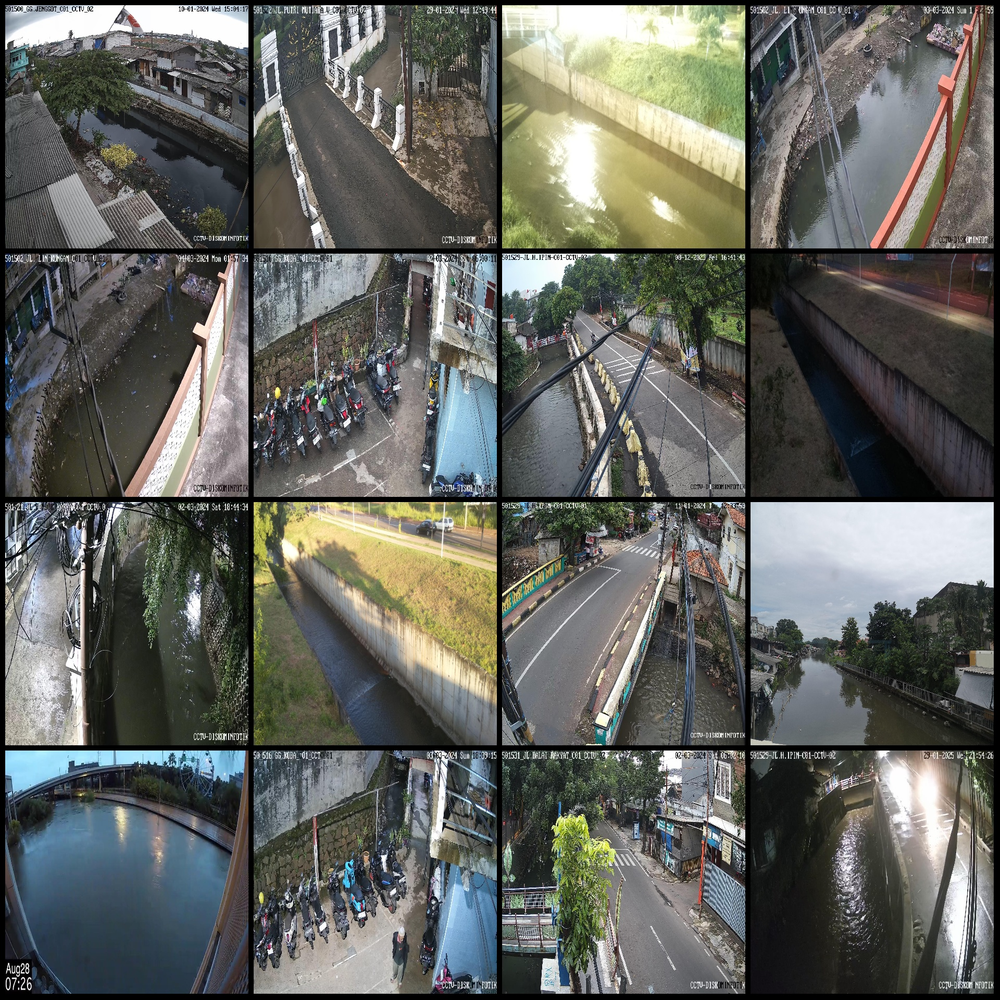
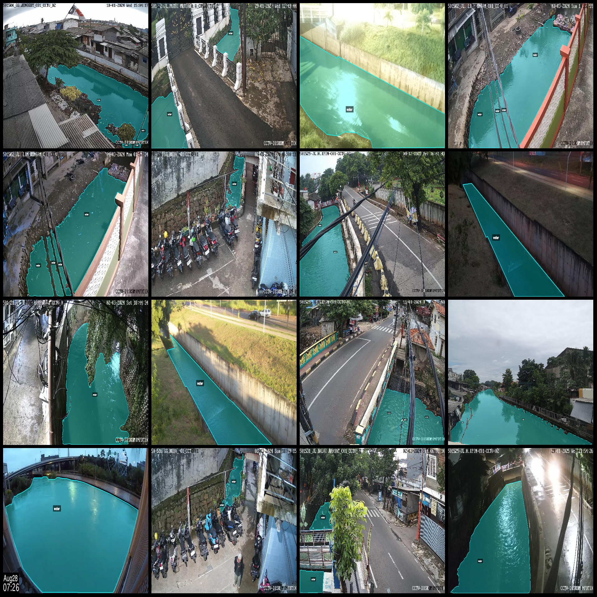
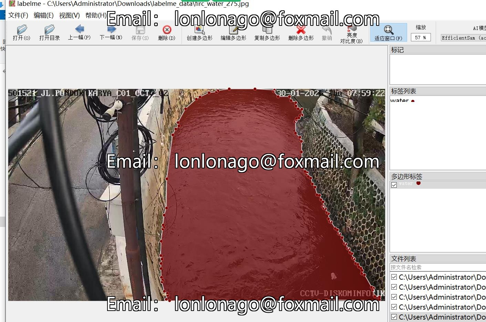

# Waterway and River Channel Segmentation Data Set in LabelMe Format with 2812 Images

The dataset is formatted as a labelme file (excluding mask files, only containing JPG images and corresponding JSON files). The number of image files is 2812. The number of labeled files is 2812. There are 1 category of labels: "water".

- Number of images: 2812
- Number of labeled images: 2812
- Number of categories: 1
- Name of the category: "water"
- Number of bounding boxes for each category: 4045
- Total number of bounding boxes: 4045
- Labelme version used: 5.5.0
- Repository: firc-dataset
- Image resolutions: Multiple resolution images, such as 1920x1080, 1477x1108, etc.
- Annotation rules: Polygons are drawn around the categories.
- Important Notes: The dataset can be opened and edited using LabelMe. The JSON dataset needs to be converted into either mask or yolo format or coco format for semantic segmentation or instance segmentation.
- Special Disclaimer: This dataset does not guarantee the accuracy of the trained models or weight files.
- Preview of the images:
- Example of the labeled image:
- Annotation drawing result:
- An example of an edit in LabelMe:

## Images

Here is a pay link on Stripe ( https://buy.stripe.com/3cs8yP7sY87d0vu9AB ). Please contact me lonlonago@foxmail.com after funding $89, and I will send you a complete data files , thank you!

